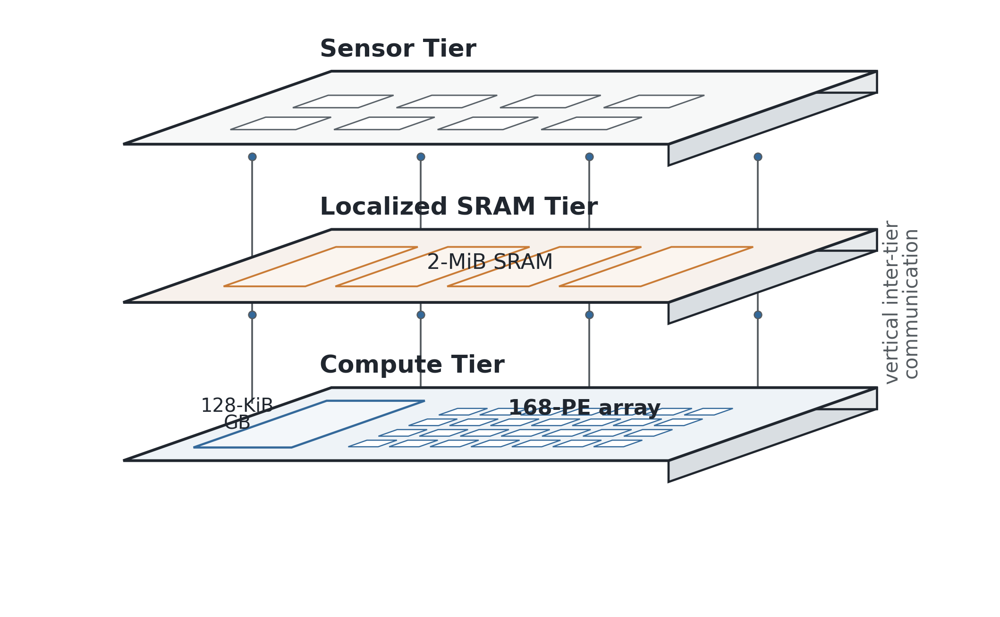
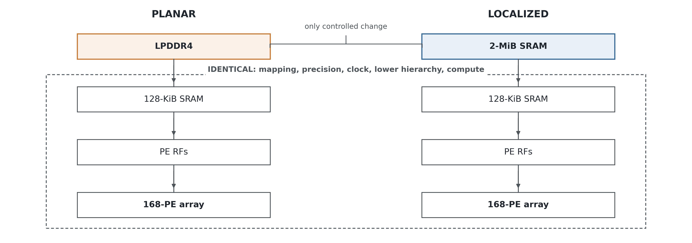
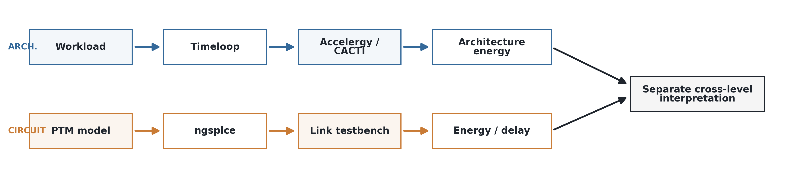
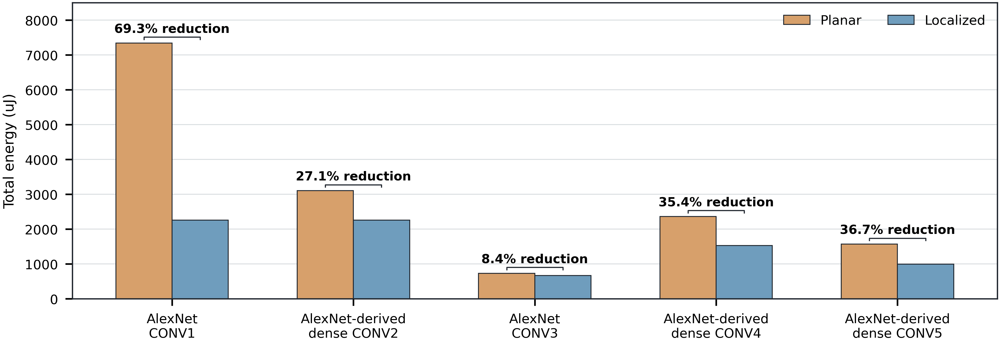
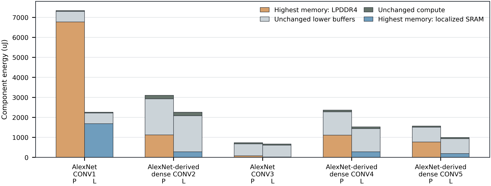
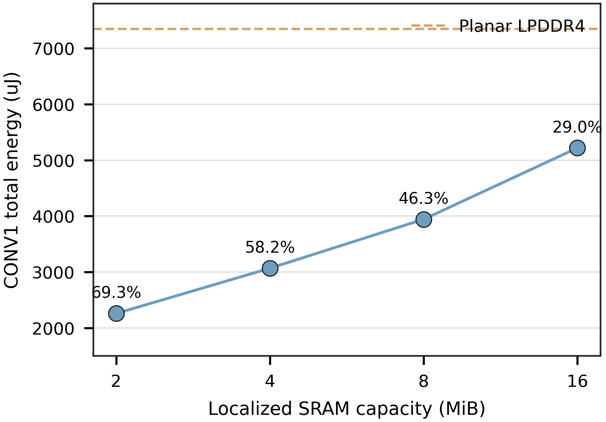
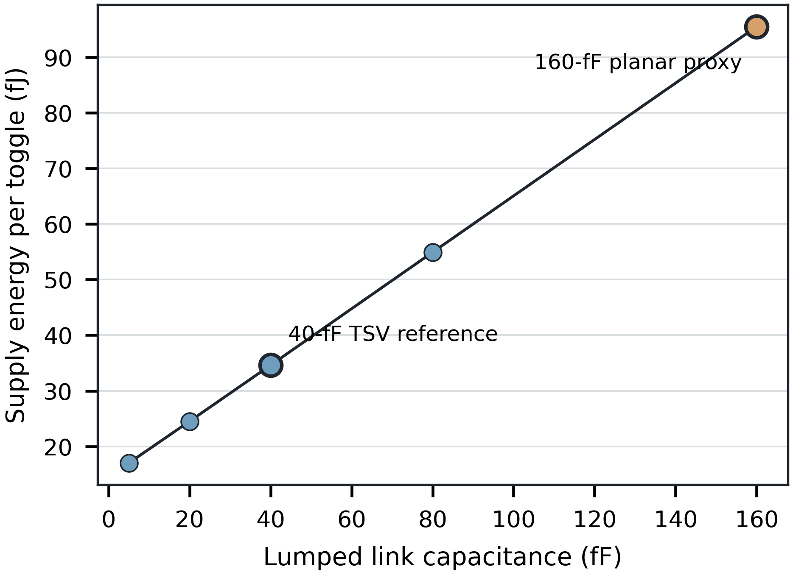
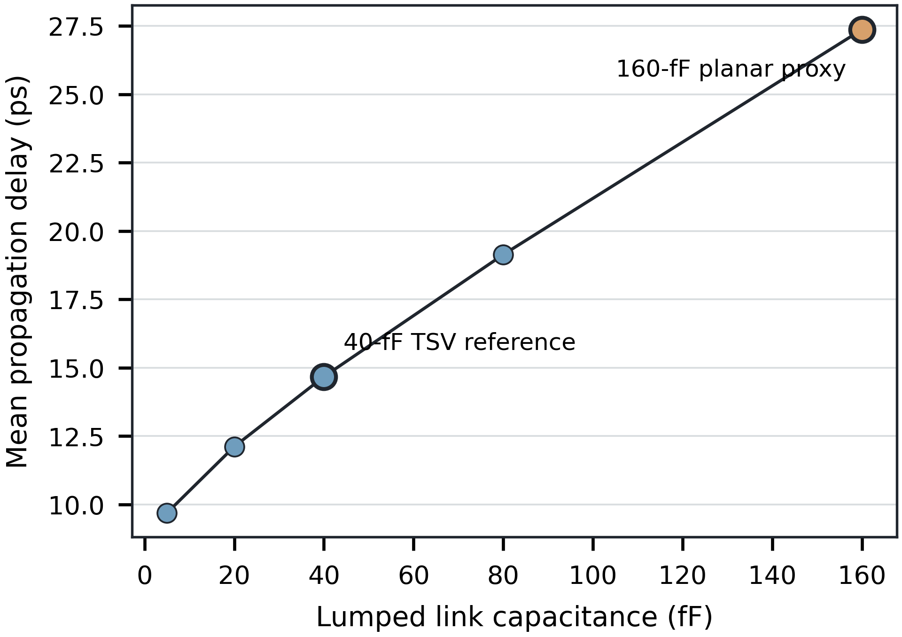

# Controlled Memory Localization for a Proposed 3D-Integrated Near-Sensor AI Organization

## Abstract

Moving sensor data and neural-network operands through a conventional external-memory hierarchy can dominate the energy of edge inference. Motivated by a proposed three-tier near-sensor organization, this work performs a controlled memory-localization study; Timeloop does not physically model the 3D stack. Five convolution configurations execute on the same 168-processing-element accelerator with identical precision, lower memory hierarchy, per-workload mapping, and nominal 1-GHz clock, while the highest memory component changes from external LPDDR4 to a 2-MiB CACTI-backed SRAM. Modeled total energy decreases by 8.36%-69.27%. The range is deliberately nonuniform: configurations with nearly equal tensor-intensity indicators exhibit reductions from 8.36% to 36.71%, showing that this scalar alone does not predict localization benefit. Component results show that, within the evaluated workloads, the planar energy fraction exposed at the substituted highest memory level closely tracks the observed benefit. Timeloop cycles and utilization are unchanged within every pair. An independent ngspice 42 testbench compares the same 45-nm CMOS driver/receiver path at a literature-referenced 40-fF TSV load and a conservative 160-fF planar-link proxy. Relative to the 160-fF proxy, the 40-fF case reduces representative-path switching energy by 63.77% and mean propagation delay by 46.38%. These circuit quantities are neither generic planar-versus-3D hardware improvements nor inference-latency results. The architecture and circuit experiments are interpreted together but are not co-simulated or numerically combined. The results establish a reproducible, workload-dependent memory-localization benefit without asserting fabricated-silicon, full-network, bandwidth-aware latency, extracted-interconnect, thermal, or sensing-accuracy validation.

**Index Terms:** 3D integration, Accelergy, CACTI, edge AI, memory hierarchy, near-sensor computing, ngspice, Timeloop.

## I. Introduction

Edge artificial-intelligence systems increasingly process data near its source to reduce communication with remote infrastructure and to operate within strict energy budgets. In these systems, arithmetic is only one part of the cost. Weights, activations, and partial sums traverse a storage hierarchy, and the energy of moving those operands can exceed the energy of the multiply-accumulate (MAC) operations themselves [1], [2]. Spatial accelerators therefore rely on data reuse and local storage to limit movement through expensive memory levels [3]. This is a domain-specific manifestation of the memory wall: increasing arithmetic throughput alone does not remove the cost of supplying data [4].

Three-dimensional integration provides a physical route to greater locality by placing sensing, storage, and compute on separate tiers connected through short inter-tier links [5], [6]. However, a 3D organization is not automatically energy efficient. Its benefit depends on the workload, mapping, working set, memory organization, and fraction of baseline energy associated with the memory level that is localized. Comparing unrelated planar and 3D accelerators would confound these factors.

This paper asks a narrower question: with the workload, compute array, precision, lower storage hierarchy, clock assumption, and per-workload mapping held fixed, how does modeled energy change when the highest memory component is changed from external LPDDR4 to localized SRAM? This substitution is motivated by the proposed 3D organization, but it is a memory-technology-and-placement proxy rather than a physical 3D model. Timeloop characterizes mapping, cycles, utilization, and memory actions [10]. Accelergy combines those actions with component energy-reference tables, with SRAM characterization generated through its CACTI integration [11]-[13]. Five convolution configurations derived from the AlexNet layer-shape files in the evaluated Timeloop repository provide a controlled workload set [14].

The five-workload experiment is the intellectual center of the study. Total-energy reduction spans 8.36%-69.27%, and AlexNet CONV3 is retained because its 8.36% result demonstrates that localization is not uniformly transformative. AlexNet CONV3, AlexNet-derived dense CONV4, and AlexNet-derived dense CONV5 have similar tensor-based intensity indicators but markedly different reductions. Their planar highest-memory energy fractions are 11.06%, 47.10%, and 48.89%, respectively. Within these evaluated workloads, the energy fraction exposed at the substituted highest level is therefore the primary observed mechanism and closely tracks the localization benefit; the generic intensity scalar alone does not.

Timeloop does not physically simulate through-silicon vias (TSVs), package wiring, or transistor-level link behavior. A separate ngspice experiment therefore evaluates the electrical motivation for lower communication loading. The testbench uses the exact committed `45nm_HP.pm` model card, an identical driver and receiver, and a capacitance sweep containing a literature-referenced 40-fF TSV case and a disclosed 160-fF planar-link proxy. These circuit results remain separate from the architecture energy totals.

The contributions are:

1. a controlled external-LPDDR4-versus-localized-SRAM Timeloop/Accelergy study across five convolution configurations on an unchanged 168-PE substrate, motivated by but not physically modeling the proposed 3D organization;
2. an evidence-backed, bounded interpretation of workload dependence using highest-memory energy share and action distribution rather than an overinterpreted scalar intensity metric;
3. a CACTI-backed 2-16-MiB SRAM-capacity sensitivity study; and
4. an independent ngspice 42 link experiment with audited PTM-model provenance, raw measurements, and capacitance sensitivity.

## II. Related Work and Positioning

### A. Accelerator memory hierarchy

Sze *et al.* survey the central role of dataflow, reuse, and storage hierarchy in efficient deep-neural-network acceleration [1]. Horowitz quantifies the broader energy disparity between arithmetic and data movement [2]. Eyeriss demonstrates how a spatial architecture and row-stationary dataflow exploit local reuse [3]. These works motivate the unchanged compute and lower-memory hierarchy used in our controlled comparison; this study does not claim to reproduce the fabricated Eyeriss chip.

### B. Three-dimensional integration

Banerjee *et al.* describe 3D integration as a means to shorten long interconnects and combine system functions [5]. Knickerbocker *et al.* review practical silicon-integration processes, including vertical interconnection and wafer-level assembly [6]. These sources establish physical feasibility but do not by themselves quantify the energy of the architecture evaluated here.

### C. Near-sensor and 3D AI systems

CamJ provides system-level energy modeling for computational CMOS image sensors and supports architectural exploration across sensing and compute organizations [7]. J3DAI presents a specialized three-wafer CMOS-image-sensor platform with a DNN accelerator [8]. Those systems address broader sensor-integrated design spaces. Our contribution is complementary: we isolate one variable, highest-level memory placement, on an otherwise identical accelerator and then evaluate one representative communication path separately. Because technology, workloads, physical scope, and metrics differ, we do not compare percentage improvements across these papers.

### D. Thermal management

Shen *et al.* demonstrate that thermally coupled 3D processor-memory stacks benefit from coordinated core dynamic-voltage/frequency scaling and memory low-power control [9]. Their findings motivate thermal-management requirements for a future implementation. The present study contains no thermal field simulation and does not convert reduced modeled energy into a temperature or sensing-accuracy result.

### E. Evaluation tools

Timeloop systematically evaluates mappings for spatial DNN accelerators [10]. Accelergy estimates architecture energy from action counts and component models [11]. The executed Accelergy CACTI plug-in uses a pinned HewlettPackard CACTI Version 7.0 source line; the CACTI 6.0 publication is cited for foundational cache and wire methodology, while CACTI 7 documents the later code-line context [12], [13]. Circuit simulation uses ngspice 42 and a public 45-nm high-performance predictive model [16]-[18].

## III. Proposed Near-Sensor Architecture

### A. Three-tier organization

Fig. 1 depicts the proposed organization as three conceptual silicon tiers. The sensor/front-end tier produces data, the localized-memory tier stores the working set, and the compute tier contains the shared global buffer and 168-PE accelerator. Vertical paths indicate conceptual inter-tier communication. The diagram is an architectural organization, not a floorplan, TSV-count specification, or extracted physical stack.

**Fig. 1.** Conceptual three-tier near-sensor architecture comprising a sensor/front-end tier, a localized-SRAM tier, and a compute tier. The compute tier contains the evaluated 128-KiB global buffer and 168-PE array. Vertical paths indicate conceptual inter-tier communication; physical geometry is not modeled.

### B. Controlled comparison

The planar and localized configurations are shown in Fig. 2. Both contain the same 128-KiB shared SRAM, PE register files, 14 x 12 compute array, arithmetic precision, technology assumption, clock, and frozen mapping. The planar case terminates highest-level traffic at LPDDR4. The localized case replaces that component with the evaluated 2-MiB SRAM. Logical highest-level read/write counts are preserved; the experiment changes their component type and energy, not the number of highest-level actions. Consequently, this comparison intentionally couples memory placement with memory technology. It quantifies the evaluated LPDDR4-to-SRAM substitution and must not be read as a geometry-only 3D effect.

**Fig. 2.** Controlled planar and localized memory hierarchies. The lower hierarchy and 168-PE compute substrate are identical; the primary modeled change is the highest-level component, external LPDDR4 versus 2-MiB localized SRAM.

## IV. Evaluation Methodology

### A. Evaluation philosophy and boundaries

Fig. 3 separates two evaluation paths. In the architecture path, workload definitions enter Timeloop, and the resulting mappings, action counts, cycles, and utilization enter Accelergy/CACTI energy estimation. In the circuit path, a PTM model enters an ngspice link testbench that reports switching energy and propagation delay. The paths meet only at qualitative cross-level interpretation. They are not co-simulated, and their percentage reductions are not combined.

**Fig. 3.** Independent architecture- and circuit-level evaluation paths. Timeloop/Accelergy/CACTI generate architecture energy, while the PTM/ngspice testbench generates representative-link switching energy and delay. The paths are interpreted separately.

### B. Workloads

Table I gives the five evaluated convolution configurations. The definitions originate from the repository's official AlexNet layer-shape YAML files. AlexNet CONV1 and AlexNet CONV3 are named directly because the evaluated dense connectivity matches the conventional layer interpretation. The source YAML files underlying AlexNet-derived dense CONV2, AlexNet-derived dense CONV4, and AlexNet-derived dense CONV5 connect every output channel to all listed input channels; canonical AlexNet uses grouped connectivity for those layers. We therefore use the full “AlexNet-derived dense” qualifier throughout.

The architecture-oriented intensity indicator is

\[
I_{tensor}=\frac{N_{MAC}}{N_W+N_I+N_O},
\]

where the denominator is the sum of weight, input-activation, and output-activation tensor elements. This deterministic descriptor is not a roofline operational intensity because it does not measure achieved bytes transferred.

**TABLE I. Five-workload characterization**

| Workload | Input | Output | Kernel / stride | MACs | Weights | Input act. | Output act. | \(I_{tensor}\) |
|---|---:|---:|---:|---:|---:|---:|---:|---:|
| AlexNet CONV1 | 227 x 227 x 3 | 55 x 55 x 96 | 11 x 11 / 4 | 105,415,200 | 34,848 | 154,587 | 290,400 | 219.69 |
| AlexNet-derived dense CONV2 | 31 x 31 x 96 | 27 x 27 x 256 | 5 x 5 / 1 | 447,897,600 | 614,400 | 92,256 | 186,624 | 501.41 |
| AlexNet CONV3 | 15 x 15 x 256 | 13 x 13 x 384 | 3 x 3 / 1 | 149,520,384 | 884,736 | 57,600 | 64,896 | 148.45 |
| AlexNet-derived dense CONV4 | 15 x 15 x 384 | 13 x 13 x 384 | 3 x 3 / 1 | 224,280,576 | 1,327,104 | 86,400 | 64,896 | 151.70 |
| AlexNet-derived dense CONV5 | 15 x 15 x 384 | 13 x 13 x 256 | 3 x 3 / 1 | 149,520,384 | 884,736 | 86,400 | 43,264 | 147.40 |

### C. Common accelerator architecture

Table II lists the common accelerator parameters. The 168 PEs form a 14 x 12 spatial array. Each PE has separate input, weight, and partial-sum register files. A 128-KiB shared SRAM sits above them. Inputs and weights are 8 bit; partial sums and MAC outputs are 16 bit. The architectural technology assumption is 45 nm, and the nominal cycle period is 1 ns.

**TABLE II. Common architecture and controlled variable**

| Parameter | Value | Status |
|---|---:|---|
| Compute array | 14 x 12 = 168 PEs | Identical |
| Input / weight precision | 8 bit | Identical |
| Partial-sum / output precision | 16 bit | Identical |
| MAC | 8-bit multiplier, 16-bit adder | Identical |
| Per-PE input RF | 12 entries | Identical |
| Per-PE weight RF | 192 entries | Identical |
| Per-PE partial-sum RF | 16 entries | Identical |
| Shared global SRAM | 128 KiB | Identical |
| Technology / period | 45 nm / 1 ns | Identical |
| Mapping | Planar mapping frozen and replayed | Identical per workload |
| Planar highest level | LPDDR4, 64-bit access width | Controlled variable |
| Localized highest level | 2-MiB SRAM, 64-bit access width | Controlled variable |

### D. Controlled planar and localized configurations

The planar configuration uses an external LPDDR4 component at the highest level. The localized configuration uses a 2-MiB, 64-bit-wide SRAM at the same hierarchy position. The lower buffers and compute units are unchanged. Consequently, the comparison is an architectural proxy for localizing memory near compute; it is not a physical simulation of a TSV network or complete 3D package. Because the controlled component changes from DRAM to SRAM, the result includes both memory-technology and placement effects and does not isolate a pure 3D geometrical advantage.

### E. Mapping controls

Each workload is mapped once on the planar reference. The selected map is then frozen and replayed in the planar and localized Timeloop model runs. The validator compares the problem, mapping directives, compute architecture, total MACs, cycles, and utilization across each pair. This procedure prevents the energy comparison from being confounded by a different dataflow or compute schedule.

### F. Timeloop methodology

Timeloop reports total computes, cycles, utilization, and per-level memory actions. The architecture evidence uses Timeloop commit `32370826fdf1aa3c8deb0c93e6b2a2fc7cf053aa`. Raw statistics, maps, XML, effective input YAML, flattened architecture, logs, and completion markers are preserved for every run.

### G. Accelergy energy accounting

Accelergy commit `6911d15686ee7efdceba7d95605102df4472ae3a` produces an energy-reference table (ERT) and area-reference table (ART). Total architecture energy is the sum over components and actions,

\[
E_{total}=\sum_c\sum_a N_{c,a}\epsilon_{c,a},
\]

where \(N_{c,a}\) is the Timeloop action count and \(\epsilon_{c,a}\) is the Accelergy energy per action. The reported interconnect/network energy is `NA` because Timeloop did not expose a separate network-energy term in these runs; it is not treated as zero.

### H. CACTI SRAM characterization

SRAM entries are generated through Accelergy CACTI plug-in commit `291018b12cc9cd467168973fc47528670e1480ce` using HewlettPackard CACTI commit `1ffd8dfb10303d306ecd8d215320aea07651e878`. The pinned README identifies this implementation as the Version 7.0 line derived from Version 6.5 and merged with CACTI-3DD. Accordingly, we cite the CACTI 6.0 paper for foundational methodology and CACTI 7 for implementation-line context; we do not call the executed code a CACTI 6.0 binary [12], [13].

### I. Capacity sensitivity

The localized CONV1 case is repeated at 2, 4, 8, and 16 MiB with the same workload, fixed mapping, lower hierarchy, and compute architecture. All capacities fit the selected layer tensors. This sweep isolates the increasing access cost of a larger modeled SRAM under an unchanged action pattern.

### J. Representative communication-link experiment

The ngspice testbench contains a CMOS driver, lumped series resistance and capacitance, a CMOS receiver, and a fanout-of-one load. Driver/receiver transistor sizes, 1.0-V supply, 20-ps input edges, stimulus, output load, and 65-mOhm resistance are identical. Only the capacitance changes across 5, 20, 40, 80, and 160 fF.

Batra *et al.* report approximately 40 fF for the evaluated TSV structure and state that bump capacitance exceeds four times TSV capacitance [15]. We therefore use 40 fF as the vertical reference and 160 fF as a conservative deterministic planar-link load proxy, calculated as 4 x 40 fF. The 160-fF point is not presented as a measured bump capacitance.

Supply charge is integrated over a steady-state 1-ns cycle. Since that cycle contains one rising and one falling data transition, energy per toggle is half the absolute supply energy per cycle. Propagation delay is measured from the 50% input threshold to the 50% receiver-output threshold, and the reported mean is the average of rise and fall delay.

### K. PTM and ngspice provenance

Transient simulation uses ngspice 42 from Ubuntu package `42+ds-3build1`, documented with the version-42 manual [18]. The exact committed model is `45nm_HP.pm`, SHA-256 `c9ed2e513523c57a76912a35b2860cb85e4aaa3402b69757d84efa9cc2fb8410`. Its header reads “PTM High Performance 45nm Metal Gate / High-K / Strained-Si” and gives nominal \(V_{DD}=1.0\) V. The model declares level 54, BSIM4 version 4.0, and nominal temperature 27 degrees C. Zhao and Cao are cited for predictive-model methodology; the University of Minnesota PTM archive is cited for the exact public card lineage [16], [17].

### L. Metrics and reproducibility

Primary architecture metrics are total energy, energy per compute, cycles, utilization, highest-level actions, and component energy. At the documented 1-GHz assumption, cycle-derived execution time equals cycles x 1 ns; it is not an end-to-end latency measurement because external-interface bandwidth is unconstrained. Circuit metrics are switching energy per toggle and propagation delay of the representative path. Every plotted or tabulated result is read from committed CSV data derived from raw outputs, and validators recompute pairwise percentages.

## V. Results

### A. Five-workload architecture energy

Fig. 4 and Table III give the principal architecture results. Localization reduces modeled total energy for every evaluated configuration, but the magnitude spans almost an order of magnitude: 8.36% for AlexNet CONV3 and 69.27% for AlexNet CONV1. AlexNet-derived dense CONV2, AlexNet-derived dense CONV4, and AlexNet-derived dense CONV5 exhibit reductions of 27.14%, 35.36%, and 36.71%, respectively.

**Fig. 4.** Timeloop/Accelergy total energy across five convolution configurations. Pair annotations show deterministic planar-to-localized reductions. Mapping, precision, lower hierarchy, compute resources, cycles, and utilization are unchanged within each pair.

**TABLE III. Five-workload Timeloop/Accelergy results**

| Workload | Intensity | Planar energy (uJ) | Localized energy (uJ) | Reduction | Cycles planar / localized | Utilization planar / localized |
|---|---:|---:|---:|---:|---:|---:|
| AlexNet CONV1 | 219.69 | 7,343.23 | 2,256.65 | 69.27% | 732,050 / 732,050 | 0.8571 / 0.8571 |
| AlexNet-derived dense CONV2 | 501.41 | 3,103.78 | 2,261.55 | 27.14% | 3,110,400 / 3,110,400 | 0.8571 / 0.8571 |
| AlexNet CONV3 | 148.45 | 732.91 | 671.67 | 8.36% | 958,464 / 958,464 | 0.9286 / 0.9286 |
| AlexNet-derived dense CONV4 | 151.70 | 2,364.95 | 1,528.64 | 35.36% | 1,437,696 / 1,437,696 | 0.9286 / 0.9286 |
| AlexNet-derived dense CONV5 | 147.40 | 1,570.14 | 993.78 | 36.71% | 958,464 / 958,464 | 0.9286 / 0.9286 |

### B. Workload dependence

The expanded set prevents a simplistic intensity interpretation. AlexNet CONV3, AlexNet-derived dense CONV4, and AlexNet-derived dense CONV5 have closely clustered indicators of 147.40-151.70 MACs per tensor element, yet their energy reductions range from 8.36% to 36.71%. AlexNet-derived dense CONV2 has the largest indicator, 501.41, but not the largest reduction. The indicator describes tensor arithmetic relative to tensor volume; it does not encode the mapped distribution of actions or the fraction of total energy at the memory level being replaced.

### C. Component-energy mechanism

Fig. 5 exposes the primary mechanism within the five evaluated workloads. In the planar cases, highest-level memory contributes 92.26% of total energy for AlexNet CONV1, 36.14% for AlexNet-derived dense CONV2, 11.06% for AlexNet CONV3, 47.10% for AlexNet-derived dense CONV4, and 48.89% for AlexNet-derived dense CONV5. The corresponding localized highest-level energy is approximately one quarter of the planar value, while lower-buffer and compute energy remain unchanged within rounding. Across this controlled set, the observed total-energy reduction closely tracks the fraction of the planar budget exposed at the substituted memory level. This is a bounded interpretation of these five mappings, not a general statistical law.

**Fig. 5.** Accelergy component-energy breakdown for all five controlled workload pairs. Within each workload, the left bar (P) is the external-LPDDR4 planar proxy and the right bar (L) is the 2-MiB localized-SRAM proxy. Timeloop action counts, lower buffers, compute resources, and mapping are unchanged; only the highest memory component changes. The figure quantifies an LPDDR4-to-SRAM substitution motivated by the proposed 3D organization, not a physical 3D-stack simulation.

Logical highest-level read/write counts are identical within each pair because the map is frozen. The localized configuration reports zero external-DRAM actions because the highest-level component is SRAM rather than DRAM; it does not report zero highest-level memory traffic. This distinction prevents the component substitution from being misdescribed as a generic reduction in total memory events.

### D. Cycle and utilization behavior

Cycles are unchanged within all five pairs: 732,050 for AlexNet CONV1, 3,110,400 for AlexNet-derived dense CONV2, 958,464 for AlexNet CONV3, 1,437,696 for AlexNet-derived dense CONV4, and 958,464 for AlexNet-derived dense CONV5. Utilization is likewise unchanged, at 0.8571 for AlexNet CONV1 and AlexNet-derived dense CONV2 and 0.9286 for AlexNet CONV3, AlexNet-derived dense CONV4, and AlexNet-derived dense CONV5. This is expected because mapping and compute resources are fixed and the model does not impose a bandwidth-dependent delay on the external interface. The reported result is therefore an energy-locality effect, not an inference-speed result.

### E. SRAM-capacity sensitivity

Fig. 6 shows the CONV1 capacity sweep. Total energy increases from 2,256.65 uJ at 2 MiB to 3,066.11, 3,941.87, and 5,217.29 uJ at 4, 8, and 16 MiB. Relative to the same 7,343.23-uJ planar baseline, the reductions are 69.27%, 58.25%, 46.32%, and 28.95%. Cycles remain 732,050. Because all capacities fit the layer tensors and the action pattern is fixed, the result exposes the modeled access-energy cost of larger SRAM rather than a capacity-miss effect. Architecturally, localization is therefore not sufficient by itself: the localized memory must be sized to the intended working set because unnecessarily large SRAM arrays incur greater modeled access energy and reduce the benefit.

**Fig. 6.** AlexNet CONV1 localized-SRAM capacity sensitivity under the same fixed mapping, lower hierarchy, and 168-PE compute substrate. The dashed line is the 7,343.23-uJ external-LPDDR4 planar baseline. Every evaluated SRAM capacity fits the selected layer tensors; larger modeled arrays increase access energy under the unchanged action pattern, reducing the localization benefit from 69.27% at 2 MiB to 28.95% at 16 MiB.

### F. Link switching energy

The literature-referenced 40-fF TSV case consumes 34.598 fJ/toggle, while the conservative 160-fF planar-link proxy consumes 95.489 fJ/toggle. Relative to that representative 160-fF proxy, the 40-fF case reduces switching energy by 63.77%; this is not a generic planar-versus-3D hardware result. Across 5, 20, 40, 80, and 160 fF, energy is 17.008, 24.512, 34.598, 54.912, and 95.489 fJ/toggle, respectively, and is monotonic over the evaluated range.

**Fig. 7.** ngspice supply energy per toggle for the identical 45-nm driver/receiver testbench over a 5-160-fF lumped-capacitance sweep. The 40-fF point is the literature-referenced TSV case; 160 fF is the conservative planar-link proxy derived as 4 x 40 fF, not a measured bump. The reported 63.77% reduction applies only to these two representative testbench loads.

### G. Link propagation delay

Mean propagation delay is 14.675 ps for the literature-referenced 40-fF TSV case and 27.367 ps for the conservative 160-fF planar-link proxy. Relative to that representative proxy, the 40-fF case reduces path delay by 46.38%; this is not an inference-latency or generic hardware-speedup claim. Rise/fall delays are 14.946/14.405 ps at 40 fF and 29.693/25.042 ps at 160 fF. The five-point mean-delay sweep is monotonic from 9.692 ps at 5 fF to 27.367 ps at 160 fF.

**Fig. 8.** ngspice mean propagation delay for the identical 45-nm driver/receiver testbench over a 5-160-fF lumped-capacitance sweep. The reported 46.38% reduction compares only the literature-referenced 40-fF TSV case with the conservative 160-fF planar-link proxy. It is a representative circuit-path quantity, not bandwidth-aware system or inference latency.

**TABLE IV. Nominal representative-link results**

| Case | Capacitance | Resistance | Energy/toggle | Rise delay | Fall delay | Mean delay |
|---|---:|---:|---:|---:|---:|---:|
| Conservative planar-link proxy | 160 fF | 65 mOhm | 95.489 fJ | 29.693 ps | 25.042 ps | 27.367 ps |
| TSV reference | 40 fF | 65 mOhm | 34.598 fJ | 14.946 ps | 14.405 ps | 14.675 ps |
| 40 fF relative to 160-fF proxy | 75.00% lower capacitance | - | 63.77% lower | - | - | 46.38% lower |

## VI. Physical-Design and Thermal Considerations

The three-tier schematic defines functional adjacency, not a completed physical design. A realizable stack would require tier dimensions, bank placement, TSV or hybrid-bond pitch and count, keep-out zones, power delivery, clocking, signal integrity, package parasitics, and thermal boundary conditions. None of those quantities is inferred from the architecture proxy.

Vertical integration can shorten some communication paths, but it also creates thermal coupling and increases the importance of heat-removal paths. Tier order, hotspots, memory temperature limits, throttling, and coordinated compute-memory power control must be evaluated together. Shen *et al.* provide a relevant framework for such coordination [9]. Their results are used as design guidance, not as thermal output of our model.

The present evaluation does not quantify sensing accuracy as a function of temperature. A defensible curve requires a specified transducer, calibrated temperature-dependent measurements, identical labeled samples across temperature, a frozen preprocessing/inference pipeline, raw predictions, ground truth, and a prespecified accuracy metric with uncertainty. The repository contains none of these inputs. The PTM card's nominal 27 degrees C setting characterizes the circuit model condition and is not sensor-temperature validation.

## VII. Discussion

### A. Cross-level interpretation

The architecture experiment and circuit experiment support complementary but independent parts of one locality argument. At architecture level, replacing high-cost external-memory actions with lower-cost SRAM actions produces reductions that closely track the baseline energy fraction exposed at that hierarchy level across the five evaluated mappings. At circuit level, reducing capacitive loading on an otherwise identical communication path reduces switching energy and propagation delay over the specified sweep. The first result includes an LPDDR4-to-SRAM technology substitution and is workload and mapping dependent; the second is a property of the representative testbench. Neither experiment physically models the proposed 3D stack.

### B. Positioning relative to prior systems

Table V distinguishes the scope from prior work. Eyeriss establishes efficient spatial acceleration and reuse [3]. CamJ models complete in-sensor visual-computing pipelines [7]. J3DAI demonstrates a specialized fabricated three-wafer sensor/accelerator platform [8]. This work neither replaces those contributions nor claims cross-platform superiority. Its value is the controlled substitution experiment, five-workload evidence, and reproducible separation of architecture and link-level quantities.

**TABLE V. Qualitative positioning**

| Work | Hardware status | Evaluation scope | Memory / communication focus | Thermal treatment |
|---|---|---|---|---|
| Eyeriss [3] | Fabricated 2D accelerator | CNN accelerator | Row-stationary local reuse | Not primary focus |
| CamJ [7] | Model validated against reported CIS chips | In-sensor system energy | 2D/3D sensing-compute exploration | Power-density exploration |
| J3DAI [8] | Specialized three-wafer platform | CMOS sensor and DNN accelerator | Near-memory DNN subsystem | Physical tiering acknowledged |
| Shen *et al.* [9] | Simulation study | 3D processor-memory thermal management | Unified core/memory power control | Quantitative thermal study |
| This work | Architecture proxy plus circuit testbench | Five convolution configurations | Controlled LPDDR4-to-SRAM substitution; separate capacitive-link sweep | Design constraints only |

### C. What the results establish

The experiments establish that, under fixed mappings and compute resources, the evaluated substitution of external LPDDR4 with localized SRAM reduces modeled energy for all five configurations, with reductions from 8.36% to 69.27%. They further establish that a tensor-based intensity scalar alone does not explain the range. Within these five workloads, the planar highest-memory energy share is the primary observed mechanism and closely tracks the localization benefit. The circuit experiment establishes monotonic switching-energy and delay dependence on capacitance for the specified 45-nm representative path; the nominal percentages apply only to the 160-fF planar proxy and literature-referenced 40-fF TSV case.

### D. Limitations

The workload set contains five individual convolution configurations, not full-network inference. AlexNet-derived dense CONV2, AlexNet-derived dense CONV4, and AlexNet-derived dense CONV5 use dense connectivity where canonical AlexNet uses groups. The architecture comparison changes both memory technology and placement from LPDDR4 to SRAM, so it does not isolate a geometry-only 3D effect. The model does not impose external-memory bandwidth timing, physically model TSVs, or separately report network energy. CACTI and PTM are predictive models rather than silicon measurements. The link testbench is lumped and not extracted from a package. Five workloads are insufficient for statistical generalization, and no regression is claimed. The study contains no RTL, place-and-route, fabricated silicon, full-network inference, thermal field, or sensor-accuracy measurement. These boundaries define the next validation steps: full-network mapping, bandwidth-aware timing, matched-technology memory alternatives, extracted interconnect and package modeling, 3D thermal simulation, and transducer-specific temperature testing.

## VIII. Conclusion

Motivated by a proposed 3D near-sensor organization, this work isolates an external-LPDDR4-to-localized-SRAM substitution on an otherwise unchanged near-sensor accelerator. Five Timeloop/Accelergy workload pairs use the same 168-PE compute substrate, precision, lower hierarchy, and mapping. Modeled energy decreases by 8.36%-69.27%, while cycles and utilization remain unchanged. Similar tensor-intensity workloads produce substantially different improvements; within the evaluated set, the fraction of planar energy exposed at the substituted highest memory level is the primary mechanism and closely tracks the observed benefit. The capacity sweep further shows that localized-memory sizing matters because larger SRAM arrays incur greater modeled access energy. In a separate ngspice 42 testbench, the literature-referenced 40-fF TSV case reduces representative-path energy by 63.77% and mean propagation delay by 46.38% relative to the conservative 160-fF planar-link proxy. These percentages do not describe generic planar-versus-3D hardware. Together, the results provide bounded evidence for memory and communication locality without claiming that Timeloop physically models a 3D stack or that the study validates fabricated silicon, full-network performance, extracted interconnects, thermal behavior, or sensing accuracy.

## References

[1] V. Sze, Y.-H. Chen, T.-J. Yang, and J. S. Emer, “Efficient processing of deep neural networks: A tutorial and survey,” *Proc. IEEE*, vol. 105, no. 12, pp. 2295-2329, Dec. 2017, doi: 10.1109/JPROC.2017.2761740.

[2] M. Horowitz, “1.1 Computing's energy problem (and what we can do about it),” in *2014 IEEE Int. Solid-State Circuits Conf. Dig. Tech. Papers*, 2014, pp. 10-14, doi: 10.1109/ISSCC.2014.6757323.

[3] Y.-H. Chen, T. Krishna, J. S. Emer, and V. Sze, “Eyeriss: An energy-efficient reconfigurable accelerator for deep convolutional neural networks,” *IEEE J. Solid-State Circuits*, vol. 52, no. 1, pp. 127-138, Jan. 2017, doi: 10.1109/JSSC.2016.2616357.

[4] W. A. Wulf and S. A. McKee, “Hitting the memory wall: Implications of the obvious,” *ACM SIGARCH Comput. Archit. News*, vol. 23, no. 1, pp. 20-24, Mar. 1995, doi: 10.1145/216585.216588.

[5] K. Banerjee, S. J. Souri, P. Kapur, and K. C. Saraswat, “3-D ICs: A novel chip design for improving deep-submicrometer interconnect performance and systems-on-chip integration,” *Proc. IEEE*, vol. 89, no. 5, pp. 602-633, May 2001.

[6] J. U. Knickerbocker *et al.*, “Three-dimensional silicon integration,” *IBM J. Res. Develop.*, vol. 52, no. 6, pp. 553-569, Nov. 2008.

[7] T. Ma, Y. Feng, X. Zhang, and Y. Zhu, “CamJ: Enabling system-level energy modeling and architectural exploration for in-sensor visual computing,” in *Proc. 50th Annu. Int. Symp. Comput. Archit.*, 2023, Art. no. 29, pp. 1-14, doi: 10.1145/3579371.3589064.

[8] B. Tain *et al.*, “J3DAI: A tiny DNN-based edge AI accelerator for 3D-stacked CMOS image sensor,” in *Proc. IEEE/ACM Int. Symp. Low Power Electron. Design*, 2025, pp. 1-7.

[9] Y. Shen, L. Schreuders, A. Pathania, and A. D. Pimentel, “Thermal management for 3D-stacked systems via unified core-memory power regulation,” *ACM Trans. Embedded Comput. Syst.*, vol. 22, no. 5s, Art. no. 120, pp. 1-26, Sep. 2023, doi: 10.1145/3608040.

[10] A. Parashar *et al.*, “Timeloop: A systematic approach to DNN accelerator evaluation,” in *Proc. IEEE Int. Symp. Perform. Anal. Syst. Softw.*, 2019, pp. 304-315, doi: 10.1109/ISPASS.2019.00042.

[11] Y. N. Wu, J. S. Emer, and V. Sze, “Accelergy: An architecture-level energy estimation methodology for accelerator designs,” in *Proc. IEEE/ACM Int. Conf. Comput.-Aided Design*, 2019, pp. 1-8, doi: 10.1109/ICCAD45719.2019.8942149.

[12] N. Muralimanohar, R. Balasubramonian, and N. P. Jouppi, “Optimizing NUCA organizations and wiring alternatives for large caches with CACTI 6.0,” in *Proc. 40th Annu. IEEE/ACM Int. Symp. Microarchitecture*, 2007, pp. 3-14, IEEE Xplore document 4408241.

[13] R. Balasubramonian, A. B. Kahng, N. Muralimanohar, A. Shafiee, and V. Srinivas, “CACTI 7: New tools for interconnect exploration in innovative off-chip memories,” *ACM Trans. Archit. Code Optim.*, vol. 14, no. 2, Art. no. 14, pp. 1-25, Jun. 2017, doi: 10.1145/3085572.

[14] A. Krizhevsky, I. Sutskever, and G. E. Hinton, “ImageNet classification with deep convolutional neural networks,” in *Advances in Neural Information Processing Systems 25*, 2012, pp. 1097-1105.

[15] P. Batra *et al.*, “Three-dimensional wafer stacking using Cu TSV integrated with 45 nm high performance SOI-CMOS embedded DRAM technology,” *J. Low Power Electron. Appl.*, vol. 4, no. 2, pp. 77-89, May 2014, doi: 10.3390/jlpea4020077.

[16] W. Zhao and Y. Cao, “New generation of predictive technology model for sub-45 nm early design exploration,” *IEEE Trans. Electron Devices*, vol. 53, no. 11, pp. 2816-2823, Nov. 2006, doi: 10.1109/TED.2006.884077.

[17] University of Minnesota, “Predictive Technology Model (PTM),” 45-nm high-performance bulk-CMOS model. [Online]. Available: https://mec.umn.edu/ptm. Accessed: Aug. 15, 2026.

[18] ngspice development team, *ngspice User's Manual*, Version 42, Dec. 27, 2023. [Online]. Available: https://sourceforge.net/projects/ngspice/files/ng-spice-rework/old-releases/42/ngspice-42-manual.pdf/download. Accessed: Aug. 15, 2026.
