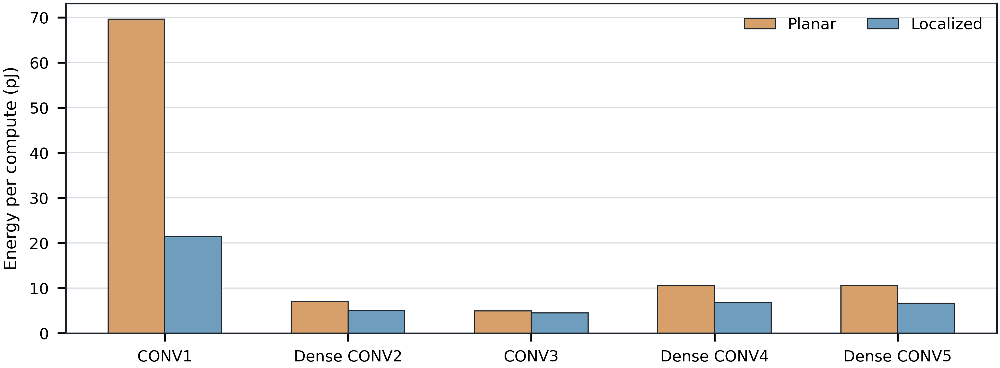
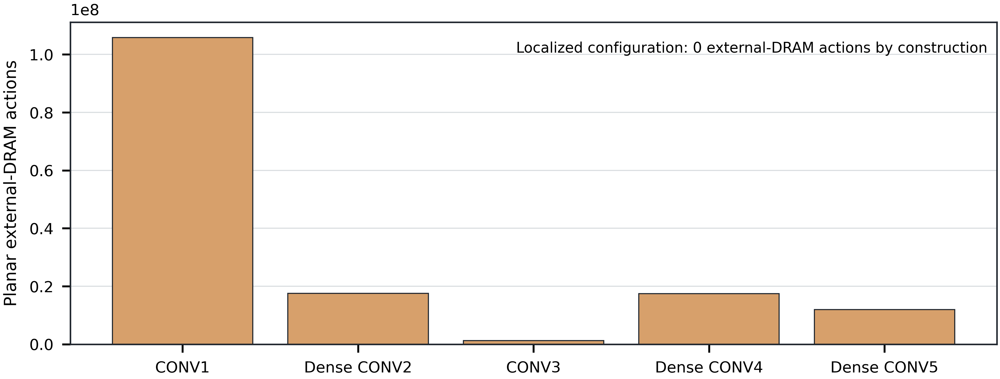
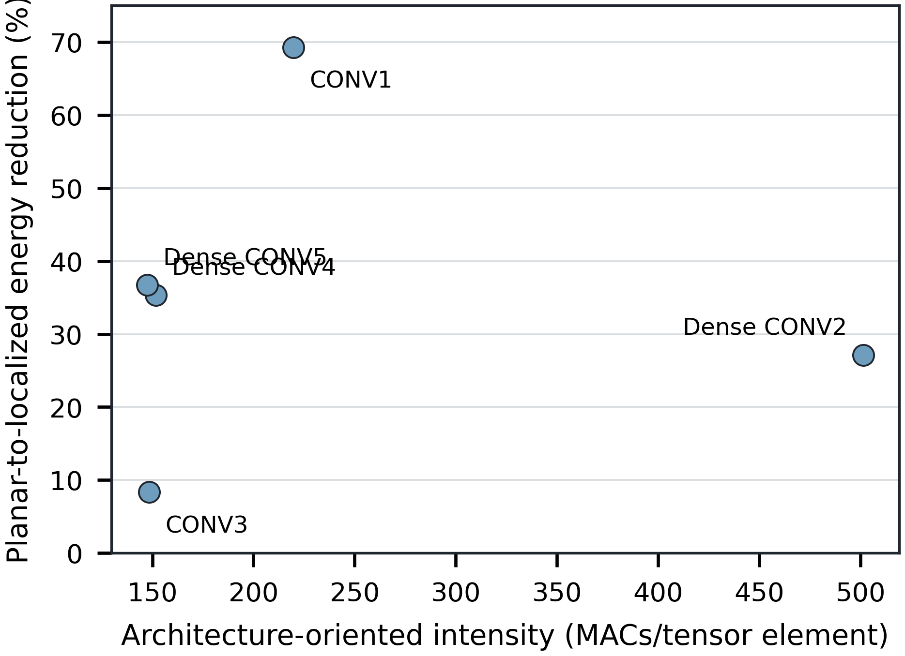

# Supplementary Material

## S1. Reproducibility and tool versions

The architecture evidence is rooted at branch `agent/full-ieee-r1-manuscript`. The original two-workload experiment was validated at architecture commit `4291da55dc45f433f6836ec0b39e96b04ccc2068`; the five-workload extension is committed at `19147f97226d38c2e7011f0ed085928d674658fb`. The setup evidence records:

- Timeloop: `32370826fdf1aa3c8deb0c93e6b2a2fc7cf053aa`;
- Accelergy: `6911d15686ee7efdceba7d95605102df4472ae3a`;
- Accelergy CACTI plug-in: `291018b12cc9cd467168973fc47528670e1480ce`;
- HewlettPackard CACTI: `1ffd8dfb10303d306ecd8d215320aea07651e878`.

The workload extension was executed in the pinned infrastructure container digest `sha256:d50887ff167f534f7a3e5eeca3d28a66b35f3f9705cf3f82443527db850492bc`. The validator reports successful raw outputs, matching problems/mappings/compute/MACs/cycles/utilization, traceability, and recomputed formulas for all five workload pairs.

The circuit evidence is rooted at branch `agent/spice-link-validation`, commit `9dfd8e40ac959f1a66d024014859a340a15df101`. The run used ngspice 42, Ubuntu package `42+ds-3build1`. The committed PTM card SHA-256 is `c9ed2e513523c57a76912a35b2860cb85e4aaa3402b69757d84efa9cc2fb8410`.

## S2. Detailed workload definitions

| Workload | Evaluated source | Q | P | C | M | R | S | Stride | Dense connectivity |
|---|---|---:|---:|---:|---:|---:|---:|---:|---|
| AlexNet CONV1 | `AlexNet_layer1.yaml` | 55 | 55 | 3 | 96 | 11 | 11 | 4 | Yes; canonical interpretation |
| AlexNet-derived dense CONV2 | `AlexNet_layer2.yaml` | 27 | 27 | 96 | 256 | 5 | 5 | 1 | Yes; differs from canonical grouping |
| AlexNet CONV3 | `AlexNet_layer3.yaml` | 13 | 13 | 256 | 384 | 3 | 3 | 1 | Yes; canonical interpretation |
| AlexNet-derived dense CONV4 | `AlexNet_layer4.yaml` | 13 | 13 | 384 | 384 | 3 | 3 | 1 | Yes; differs from canonical grouping |
| AlexNet-derived dense CONV5 | `AlexNet_layer5.yaml` | 13 | 13 | 384 | 256 | 3 | 3 | 1 | Yes; differs from canonical grouping |

The stored workload names remain unchanged for reproducibility. Manuscript-facing labels correct the connectivity interpretation.

## S3. Full architecture parameters

| Component | Parameter | Value |
|---|---|---:|
| Array | Mesh | 14 x 12 |
| Array | PE count | 168 |
| MAC | Multiplier width | 8 bit |
| MAC | Adder/output width | 16 bit |
| Input RF per PE | Depth / width | 12 / 16 bit |
| Weight RF per PE | Depth / width | 192 / 16 bit |
| Partial-sum RF per PE | Depth / width | 16 / 16 bit |
| Shared SRAM | Capacity | 128 KiB |
| Shared SRAM | Depth / width / banks | 16,384 / 64 bit / 32 |
| Planar highest level | Type / width | LPDDR4 / 64 bit |
| Localized highest level | Type / nominal capacity / width | SRAM / 2 MiB / 64 bit |
| Architecture | Technology / period | 45 nm / 1 ns |

## S4. Detailed action counts

Highest-level logical action counts are identical within each planar/localized pair. The external-DRAM columns differ because the localized highest-level component is SRAM.

| Workload | Highest reads | Highest writes | Planar external-DRAM actions | Localized external-DRAM actions |
|---|---:|---:|---:|---:|
| AlexNet CONV1 | 105,569,787 | 290,400 | 105,860,187 | 0 |
| Dense CONV2 | 17,338,752 | 186,624 | 17,525,376 | 0 |
| AlexNet CONV3 | 1,072,128 | 194,688 | 1,266,816 | 0 |
| Dense CONV4 | 17,338,752 | 64,896 | 17,403,648 | 0 |
| Dense CONV5 | 11,950,848 | 43,264 | 11,994,112 | 0 |

## S5. Component energy breakdown

| Workload | Architecture | Highest memory (uJ) | Lower buffers (uJ) | Compute (uJ) | Total (uJ) |
|---|---|---:|---:|---:|---:|
| AlexNet CONV1 | Planar | 6,775.052 | 526.162 | 42.013 | 7,343.23 |
| AlexNet CONV1 | Localized | 1,688.475 | 526.162 | 42.013 | 2,256.65 |
| Dense CONV2 | Planar | 1,121.624 | 1,803.648 | 178.510 | 3,103.78 |
| Dense CONV2 | Localized | 279.387 | 1,803.648 | 178.510 | 2,261.55 |
| AlexNet CONV3 | Planar | 81.076 | 592.242 | 59.591 | 732.91 |
| AlexNet CONV3 | Localized | 19.832 | 592.242 | 59.591 | 671.67 |
| Dense CONV4 | Planar | 1,113.833 | 1,161.729 | 89.387 | 2,364.95 |
| Dense CONV4 | Localized | 277.519 | 1,161.729 | 89.387 | 1,528.64 |
| Dense CONV5 | Planar | 767.623 | 742.926 | 59.591 | 1,570.14 |
| Dense CONV5 | Localized | 191.260 | 742.926 | 59.591 | 993.78 |

The planar highest-memory share is 92.26%, 36.14%, 11.06%, 47.10%, and 48.89% for CONV1 through dense CONV5. This component share, not the tensor-intensity scalar, explains the overall reduction in the controlled substitution.


**Fig. S3.** Component-energy breakdown. Lower-buffer and compute energy are unchanged within each pair; the highest-level component produces the observed total-energy difference.

## S6. Energy-per-compute results

| Workload | Planar (pJ/compute) | Localized (pJ/compute) | Reduction |
|---|---:|---:|---:|
| AlexNet CONV1 | 69.660 | 21.407 | 69.27% |
| Dense CONV2 | 6.930 | 5.049 | 27.14% |
| AlexNet CONV3 | 4.902 | 4.492 | 8.36% |
| Dense CONV4 | 10.545 | 6.816 | 35.36% |
| Dense CONV5 | 10.501 | 6.646 | 36.71% |



**Fig. S2.** Energy normalized by Timeloop computes for the five controlled workload pairs.

## S7. External-memory activity



**Fig. S4.** Planar external-DRAM actions. The localized model records zero external-DRAM actions by construction because its highest-level component is SRAM. Logical highest-level action counts remain unchanged.

## S8. SRAM-capacity sweep data

| Capacity | Total energy | Reduction vs. planar | Cycles |
|---:|---:|---:|---:|
| 2 MiB | 2,256.65 uJ | 69.27% | 732,050 |
| 4 MiB | 3,066.11 uJ | 58.25% | 732,050 |
| 8 MiB | 3,941.87 uJ | 46.32% | 732,050 |
| 16 MiB | 5,217.29 uJ | 28.95% | 732,050 |

## S9. ngspice netlist and model provenance

The representative testbench uses a 4-um NMOS / 8-um PMOS output driver, 1-um NMOS / 2-um PMOS receiver, identical fanout-of-one load, 1.0-V supply, 45-nm channel length, 20-ps source transitions, 65-mOhm series resistance, and a lumped capacitance. The nominal cases differ only in case label and `CLINK`.

The model header is:

```text
* PTM High Performance 45nm Metal Gate / High-K / Strained-Si
* nominal Vdd = 1.0V
```

The card declares BSIM4 level 54, version 4.0, and `tnom=27`. The raw nominal runs each contain a byte-identical copy of the model.

## S10. Transient measurement definitions

The steady-state supply-charge integral is evaluated from 1.05 ns to 2.05 ns. Energy per cycle is the magnitude of the integral multiplied by 1.0 V; energy per toggle divides the cycle energy by two because one rise and one fall occur per cycle. Rise and fall propagation delays use 50% input and output thresholds. Link rise/fall time uses 10%-90% thresholds.

## S11. Link-capacitance sweep

| Capacitance | Energy/toggle | Rise delay | Fall delay | Mean delay |
|---:|---:|---:|---:|---:|
| 5 fF | 17.008 fJ | 9.389 ps | 9.996 ps | 9.692 ps |
| 20 fF | 24.512 fJ | 12.074 ps | 12.158 ps | 12.116 ps |
| 40 fF | 34.598 fJ | 14.946 ps | 14.405 ps | 14.675 ps |
| 80 fF | 54.912 fJ | 20.078 ps | 18.200 ps | 19.139 ps |
| 160 fF | 95.489 fJ | 29.693 ps | 25.042 ps | 27.367 ps |

## S12. Checksums and traceability

Architecture metric-to-file mappings are preserved in `ieee_revision/experiments/processed/traceability.csv`. Circuit metric-to-file mappings are preserved in `ieee_revision/spice_validation/processed/traceability.csv`. The circuit checksum file includes every netlist, raw output, waveform, processed CSV, script, figure, and model copy. The final submission evidence manifest records the authoritative branch, commit, and path for every source class.

## S13. Claim-evidence boundary and workload-intensity figure



**Fig. S1.** Tensor-intensity indicator versus planar-to-localized energy reduction. Points are shown individually; no regression or trend line is fitted. Similar indicator values for CONV3, dense CONV4, and dense CONV5 produce reductions from 8.36% to 36.71%, so no universal intensity-energy relationship is inferred.

The architecture model supports energy, action, cycle, and utilization claims only. The ngspice model supports representative-path energy and delay only. Neither supports sensing accuracy, thermal fields, complete physical implementation, or fabricated-silicon performance. No temperature-labeled sensing dataset, sensor transfer function, prediction set, ground truth, or accuracy metric exists; consequently no sensing-accuracy-versus-temperature curve is generated.
